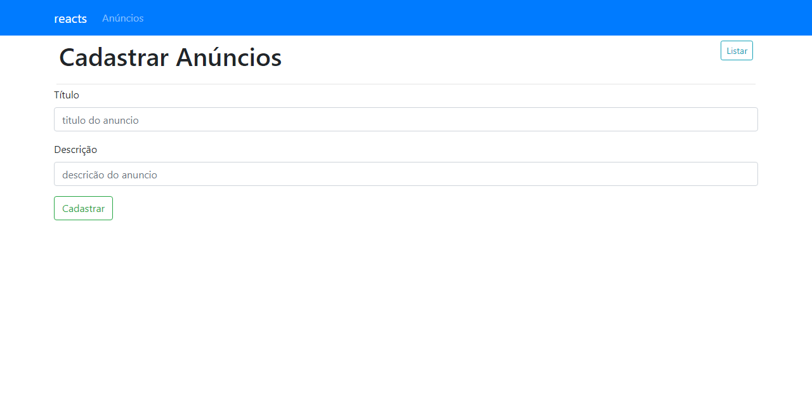

  <a href="#-tecnologias">Tecnologias</a>&nbsp;&nbsp;&nbsp;|&nbsp;&nbsp;&nbsp;
  <a href="#-projeto">Projeto</a>&nbsp;&nbsp;&nbsp;|&nbsp;&nbsp;&nbsp;
  <a href="#-layout">Layout</a>&nbsp;&nbsp;&nbsp;|&nbsp;&nbsp;&nbsp;
  <a href="#memo-licença">Licença</a>

 

  

## 🚀 Tecnologias

Esse projeto foi desenvolvido com as seguintes tecnologias:

- HTML
- CSS
- JavaScript
- React js
- NodeJS
- Express
- Mysql
- Axios
- Cors

## 💻 Projeto

Sistema completo de Cadastro de eventos com banco de dados.

## 🔖 Como usar ?

- git clone git@github.com:thiagomendesdeveloper/EventUp.git

- npm install

- npm start 

